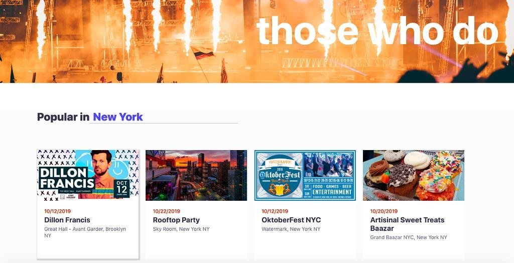

# Eventhype Fullstack 
### Eventhype is a clone of the website Eventbrite. It is a website where you can browse events and buy tickets/register to events in your area. If you create an account you can create/update/delete events which people can buy tickets for. You can also bookmark events to be saved.

### Link to live site: https://eventhype.herokuapp.com/#/

### Functionality and MVP Features 
* 2-step User Authentication and Guest log in
* Add/Delete/Update Events
* Register/Unregister to Events
* Filter events by category
* Bookmark events
* Host on Heroku 

### Architecture and Technologies  
* Technologies used: Rails, ReactJS, Redux, PostgreSQL, HTML, CSS, Webpack, AWS, Heroku
* To create this clone I used Rails as the backend and React-Redux for the frontend. 
* Customized JSON responses with JBuilder to improve efficiency between Rails API and front-end interface.
* Implemented a two-step user authentication that ensures user privacy and autonomy through frontend and
backend authentication measures using cookies to persist authorization across sessions.
  ```Javascript 
        render() { 
        return ( 
            <div className="email-container">
                
                <h2>Let's get started</h2>
                <p>Use email to get started.</p>
                <form className="form-email">
                    <input type="text" value={this.state.email} placeholder="  Email address" onChange={this.handleInput('email')}  />
                    <button onClick={this.handleSubmit}>Get Started</button>
                    <button onClick={this.demoLogin}className="demo">Demo User</button>
                </form>
            </div>
        )
    }
  ```

  ```Javascript 
        handleSubmit(e) {
        e.preventDefault();
        debugger
        const email = Object.assign({}, this.state);
        this.props.findUser(email).then((user) => {
            this.props.history.push({
                    pathname:'/signin/login',
                    // debugger
                    state: {email: this.state.email}
        })
    }  , () => this.props.history.push({
                    pathname: '/signin/signup', 
                    state: {email: this.state.email }
            })
        )
}
  ```
* Connected Active Record models to Active Storage and AWS3 to store image uploads in the cloud for users to
use custom photos when creating events.
* Harnessed the unidirectional state management of Redux to simplify React components and directly manage
data.




